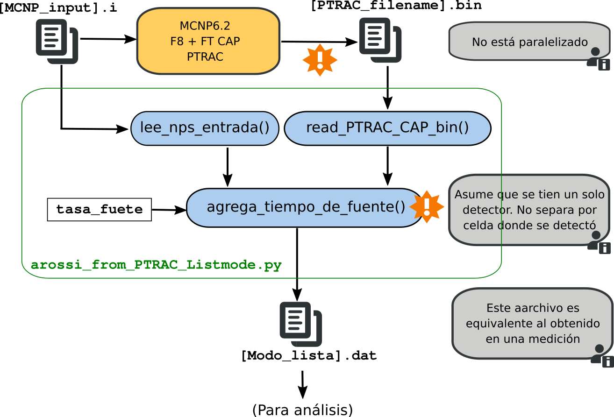

# Procedimiento para simular un experimetno de ruido neutrónico

**Objetivo**: explicar brevemente cómo realizar una simulación de ruido neutrónico (sin fotones)

La simulación consta de varias etapas y en cada una de ellas es necesario entender bien qué se está haciendo y cómo se está haciendo.

Algunas scripts ya están hechos, otros no y quizá sea necesario hacerlos.

Se podría pensar en tres etapas:

1) Simulación con MCNP
2) Post-procesamiento de lo simulado para generar archivo en modo lista
3) Análisis del archivo simulado y obtención de parámetros físicos

Los pasos 1) y 2) en conjunto producen un archivo similar al que se obtiene en una medición.

El paso 3) es el que usualmente utilizamos para procesar los datos simulados

Analizzamos en detalle cada uno de estas etapas.

## 1) Simulación con MCNP 

La simulación consiste en obtener los tiempos en que cada neutrón es capturado en el/los detectores.

Esto se logra mediante el uso (principalmente) de tres tarjetas:

F8 + FT CAP + PTRAC

Prestar atención porque el formato con que se guardan los datos en la PTRAC cuando se la utiliza con la FT CAP  es completamente distinto al formato estandar de una PTRAC.

En el archivo PTRAC quedan registradas (entre otras cosas) las tres magnitudes que se usarán en la simulación. Por cada neurón de fuente que se simula, se registran:

a) Los tiempos en que se produjeron las capturas de los neutrones generados a partir de dicho neutrón de fuente.

b) El número de historia a la que pertenece el neutrón capturado (un neutrón de fuente puede generaar muchos neutrones que luego son capturados).

c) La celda en donde fue capturado (equivalente a decir en qué detector fue capturado).

El archivo PTRAC puede grabarse tanto en formtato ASCII como en binario. El problema es que en formato ASCII tiene un ancho de caracteres fijo y eso hace que se pierdan dígitos relevantes para el análisis de ruido.

Conviene trabajar con el binario.

## 2) Post-procesamiento de la simulación

En esta parte se debe leer el archivo generado por MCNP (arvhivo PTRAC) y producir un nuevo archivo en modo lista (timestamp) para cada detector. Dicho archivo es similar al que se hubiera obtenido con una medición.

Aquí es donde entra en juego la actividad de la fuente. Recordar que los tiempos de captura registrados en el archivo PTRAC son respecto al tiempo en que salió el neutrón de fuente (aunque se ponga una distribución de tiempo a la fuente, el FT CAP siempre registra la diferencia de tiempos). Se debe entonces asignar un tiempo al evento de fuente, y luego sumarlo al tiempo que aparece en el archvo PTRAC.

Para asignar los tiempos, se va a simular con Python los tiempos en que fueron generados los neutrones de fuentes (distribución exponencial acumulada). Se deben sortear nps tiempos (la misma cantidad de eventos totales de fuente). El parámetro de la distribución exponencial es la cantidad media de eventos fuente por unidad de tiempo. Notar que una vez definida la actividad (y junto con el nps) queda definido el tiempo total de la "medición".

Para ver esto último, supongamos que se producen $\lambda$ eventos de fuente por unidad de tiempo. Si se simula una fuente basada en la reacción $(\alpha,n)$ $\lambda$ será la cantidad de neutrones emitidos por unidad de tiempo. Si en cambio se simula una fuente de fisión espontánea, $\lambda$ será la actividad parcial de fisión espontánea de dicha fuente (pues MCNP toma como historia la fisóń espontánea, y no a los neutrones producidos por fisión).

En uno u otro caso será válido que la distribución de tiempo entre eventos ($\tau$) de fuente es una distribución exponencial:

\begin{equation}
p(\tau; \lambda) = \lambda e^{-\lambda \tau}
\end{equation}

El tiempo simulado para el evento de fuente i-ésimo será:

\begin{equation}
t_i = \sum_{k=0}^{i-1} \tau_i
\end{equation}

donde se asume $\tau_0=0$.

Si se simulan N neutrones (nps=N), se tendrá que el tiempo total de la simulación (T) es:

\begin{equation}
T = t_N = \sum_{k=0}^{N-1} \tau_i = N \frac{1}{N} \sum_{k=0}^{N-1}\tau_i = \frac{N}{\lambda}
\end{equation}

pues $1/\lambda$ es el tiempo promedio entre dos eventos de fuente $\tau$. En esta deducción se está despreciando el tiempo entre la emisión de la fuente y la detección de algún neutrón generado (es del órden de los ms).

Continuamos con el procedimiento. Para construir estos tiempo, primero hay que agrupar entre todos los tiempos registrados en el PTRAC, aquellos que pertenecen al mismo evento de fuente. A todos esos tiempos, se le suma uno de los tiempos de fuente generado. Obviamente, muchos de los tiempos generados no se van a utilizar (pues no todos los eventos de fuente van a producir neutrones que sean detectados)

Una vez que están con los tiempos correctos, se deben separar de acuerdo a la celda en donde fueron detectados. Se debe generar un archivo de tiempos por cada detector simulado (esto es así porque los scripts de procesamiento trabajan de esa manera).

Una vez que están separados por detector, se ordena los tiempos de forma ascendente y se los guarda en un archivo. Este archivo es el equivalente al obtenido en una medición real.

En el siguiente gráfico se hizo un esquema simplificado de los programas y scripts que se utilizaron para realizar algunas de estos pasos:

## 3) Análisis

TODO

# Procedimiento para paralelizar la simulación

El programa MCNP6 no permite su paralelización cuando (entre otras cosas) se utiliza la tarjeta PTRAC. Por este motivo es necesario realizarla manualmente, en el sentido en que se debe ejecutar varias instancias en paralelo de corridas de MCNP6.

TODO
