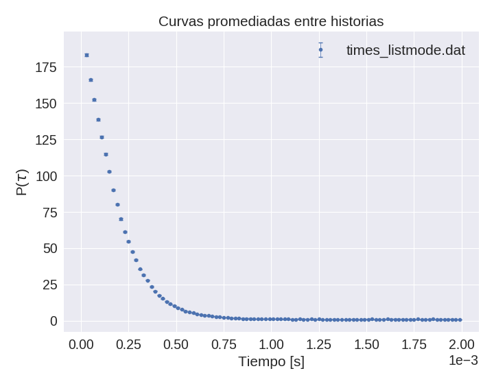

# Simulación de los tiempos de captura con MCNP

Se simulan los tiempos en que los neutrones son capturados en un detector de neutrones.

## Análisis de alfa-Rossi

Resultados preliminares:

## TODO

  * Analizar los tiempos característicos. Ver los tiempos de neutrones moderados y sin moderar (tratar de distinguir las dos exponenciales)

  * Agregar tiempos muerto a la simulación previo al análisis

  * Agregar fotones 

  * Construiir otro PTRAC para fotones capturados en otro detector
