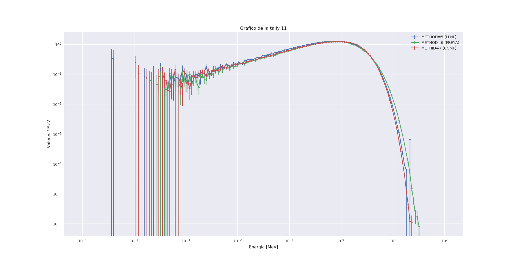
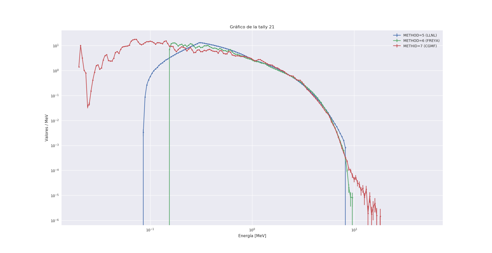

# _Simulación fuente de $^{252}Cf$_

La simulación de una fuente de fisiones espontáneas de $^{252}$Cf en MCNP depende mucho de qué fenómenos se quieran simular (fotones, neutrones, correlaciones temporales, angulares, etc).

Si se lo ordena en orden creciente de complejidad y dificultad (y tal vez en tiempo de máquina) se pueden plantear los siguientes ecenarios en base a lo que se quiere obtener de la fuente:

### 1) Neutrones no correlacionados

- Se simulan neutrones utilizando un espectro de fisión de Watt

 \begin{equation}
 f(E) = C e^{-E/a} sinh(\sqrt{bE})
 \end{equation}
   
- EN `SDEF` se utiliza:
    * PAR=n ENG=d1
    * SP1 -3 a b (ver apéndice C del manual)


### 2) Fotones no correlacionados

- No está implementado en MCNP, pero sí en MCNP-DSP, igualmente es relativamente sencillo.

- Se utiliza una función fenomenológica que ajusta el espectro experimental (T.E. Valentine, ver manual de MCNP-DSP):

\begin{equation}
N(E) = \begin{cases} 38.13(E-0.085)e^{1.648E}  & E<0.3\,MeV \\
                     26.8e^{-2.3E} & 0.3 < E < 1.0 MeV \\
                     8.0e^{-1.10E} & 1.0 < E < 8.0 MeV 
        \end{cases}
\end{equation}

(en verdad es un ajuste al espectro de emisión del $^{235}U$, pero son muy similares.)

- EN `SDEF` se utiliza:
    * PAR=p ENG=d1
    * SP1 (de la forma que se quiera)

### 3) Neutrones correlacionados

- Está implementado en MCNP6

- En `SDEF` se utiliza:
    * PAR=SF  (y debe muestrearse una celda que contenga al $^{252}Cf$
    * FMULT METHOD=3 (no es necesario, se activa automáticamente con lo anterior)
- La energía se muestrea del espectro de Watt con los parámetros adecuados (a,b)
- El generador de eventos no produce fotones


### 4) Neutrones y fotones correlacionados

- Existen tres métodos con generadores de eventos en MCNP capaces de simular el proceso de fisión y la emisión de fotones y neutrones.

- Estos generadores de eventos se pueden utilizar por separado, y algunos están implementados en otros programas (GEANT4.10, TRIPOLI-4.10 y MORET).

- En `SDEF` se utiliza
    * PAR=SF  (y debe muestrearse una celda que contenga al $^{252}Cf$
    * FMULT METHOD=j 

- El número j puede ser:
    * j=5  método LLNL
    * j=6  método FREYA (Fission Reaction Event Yield Algorithm)
    * j=7  método CGMF (Cascading Gamma-ray Multiplicity + Fission

- Activar estos métodos anula la capacidad de MCNP6 de paralelizar. Se debe paralelizar a mano (script en bash/python que mande muchas corridas con distintas semillas y luego se juntan los resultados).

- Los tiempos de corrida con CGMF son órdenes de magnitud mayores al resto (> x100)

{width=135%}

{width=135%}

\pagebreak

## Código de MCNP6.2 utilizado para los ejemplos

```
Caracteristicas de emision del Cf252 usando metodo CGMF (METHOD=7)
c
c
100 1  -1e-10   -1000  imp:n,p=1  $ Cf252
102 0            1000  imp:n,p=0  $ Nada

1000 SO  0.000000001              $ Esfera para Cf252

M1    98252.80c     1             $ Cf252
c ***************************************************
c FUENTE
c ***************************************************
c Fuente puntual
c
SDEF  PAR=-SF 
c ***************************************************
FC11 Neutrones que salen de la fuente
F11:n 1000
E11 1e-5 198ILOG 100 
c
FC21 Fotones que salen de la fuente
F21:p 1000
E21 2e-2 198ILOG 50
c ***************************************************
c PTRAC - opcional, ojo con el tamaño (1.7GB)
c ***************************************************
PTRAC BUFFER=1000 FILE=bin MAX=1e9 TYPE=n,p WRITE=all EVENT=ter
FMULT METHOD=7
c TOTNU NO
MODE n p 
CUT:n J J 0 0           $ Fuerza captura analógica
CUT:p J J 0 0           $ Fuerza captura analógica
RAND GEN=2 SEED=1
NPS 1e6 
PRINT
```

